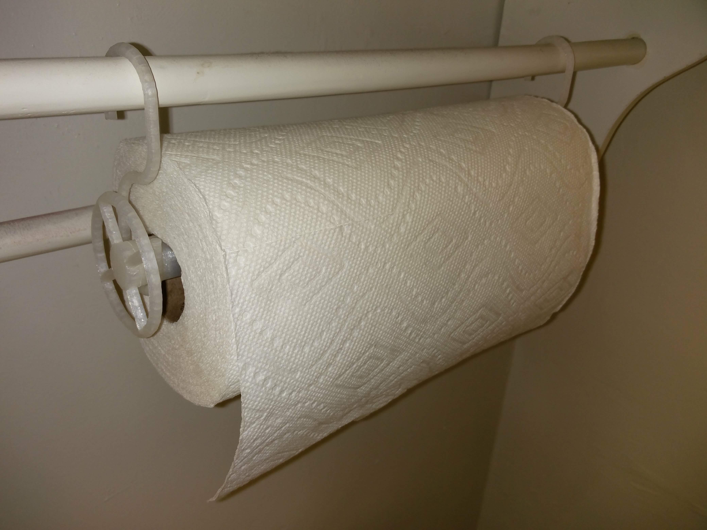
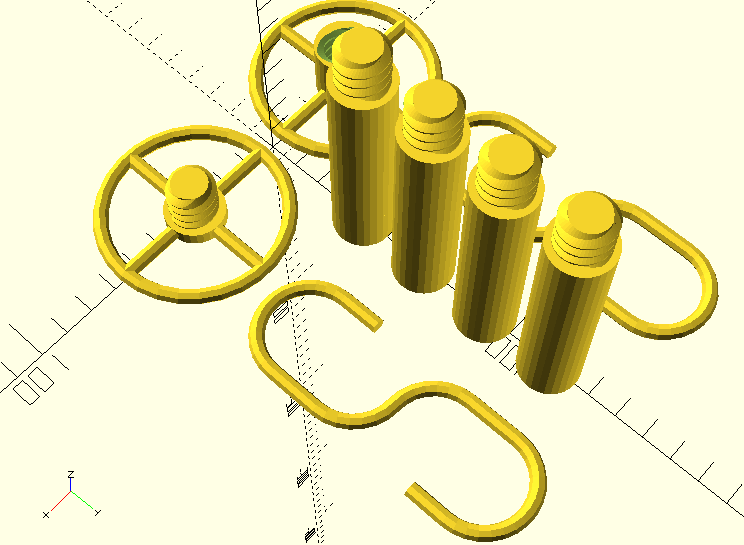

# Paper Towel Holder #

OpenSCAD models for a Paper Towel Holder.  The components can be screwed together, so you won't need a particularly large printer to print this.

## Usage ##

The main files to look at are:

| File | Purpose |
| ---- | ------- |
| [complete.scad](./complete.scad) | Lays out all of the components so that they can all be printed at once. |
| [constants.scad](./constants.scad) | Contains the parameters that I used for my specific print.  Feel free to revise as necessary. |

